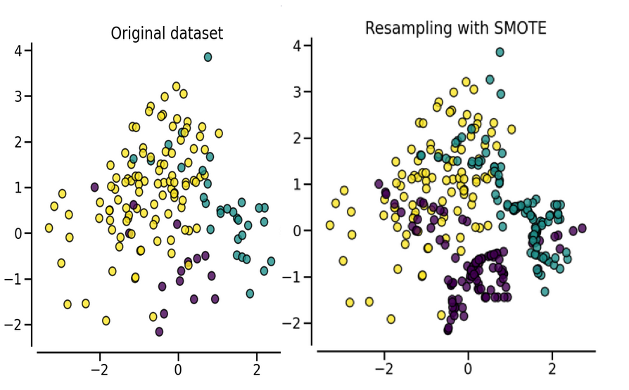
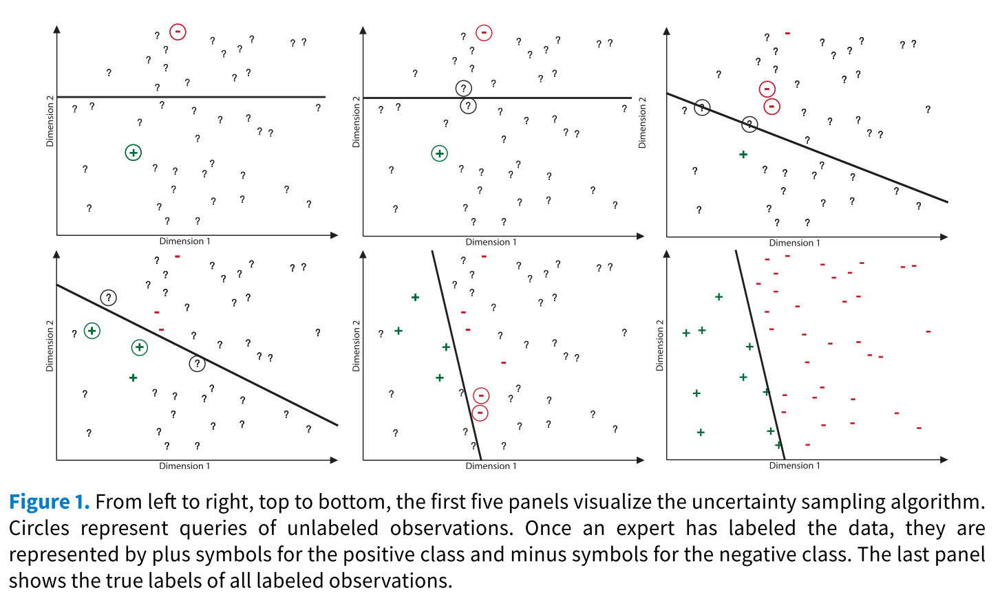
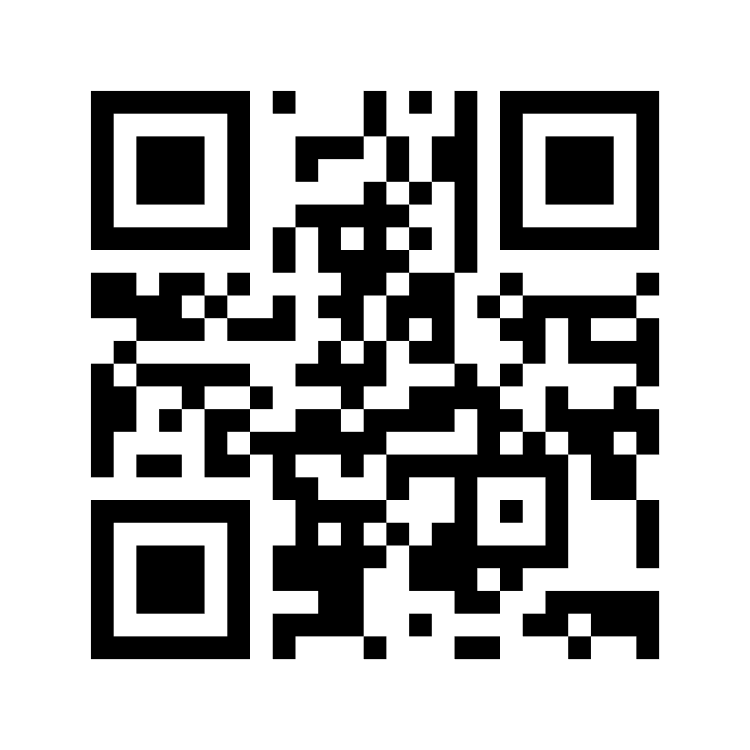

```{r xaringan-themer, include=FALSE, warning=FALSE}
library(xaringanthemer)

style_mono_dark(
  base_color = "#68909c", #"#9f7960", #"#1F4257", #"#cc5200", #"#ccfff5",
  text_bold_color = "#a3423c", 
  text_slide_number_color = "#a3423c",
  base_font_size = "32px",
  header_h1_font_size = "1.8rem",
  header_h2_font_size = "1.4rem",
  header_h3_font_size = "1.1rem",
  header_background_auto = T,
  text_font_google =  google_font("Oswald"),
  code_font_size = "24px"
  )

```

```{r setup, include=FALSE}

knitr::opts_chunk$set(echo = FALSE, message = F, warning = F, cache = T, out.width="80%", fig.height=4, fig.width=10, fig.align='center', eval = T, dev = "svg")
# knitr::opts_knit$set(root.dir = 'C:/Users/nicol/Dropbox/PhD/Papers/Bild/github/bild')

# add css
new_css <-
  ".hljs-github-dark .hljs {
    background: #68909c;
  }

"
write(new_css,
      file = "xaringan-themer.css",
      append = TRUE)

library(tidyverse)
library(dplyr)
library(data.table)
library(fixest)
library(lubridate)
library(patchwork)
library(icons)

```


class: inverse, center, middle


# **Imbalanced Learning**

## How to Deal With Imbalanced Data in Supervised Classification Problems


### Nicolai Berk<sup>*</sup>

### Tutorial at the 4th Annual **CompText** Conference 2022, Dublin

`r Sys.Date()`


.left[.footnote[<sup>*</sup> Dynamics RTG & Humboldt Universität Berlin]]

---

# Hi


## I am Nicolai Berk

- PhD Candidate at Dynamics RTG, Humboldt Universität zu Berlin
- Interested in political discourse, specifically the making of political issues
- Using **R**, sometimes **Python**
- Analysing text for the past four years

.center[

[www |](nicolaiberk.com) [`r icon_style(fontawesome("at"), fill = "#68909c")` |](mailto:nicolai.berk@gmail.com) [`r icon_style(fontawesome("github"), fill = "#68909c")` |](https://github.com/nicolaiberk) [`r icon_style(fontawesome("twitter"), fill = "#68909c")`](https://twitter.com/nicolaiberk)

]


---


# About this Class

- Some familiarity with Python expected
- Supervised ML = Bag-of-Words
- Structure: Conceptual - Specific - Application

---

# Schedule

.right-column[

.footnote[

| Time frame | Topic |
|:------------- | -------------- | 
|**First hour** | Intro to Supervised ML in Python | 
| | Showcase of `scikit-learn` | 
| | Small Coding Challenge | 
|**Break** | |
|**Second hour** | Intro to Imbalanced learning |
| | Showcase of one of Sampling/SMOTE/Active Learning |
| | If time: Questions |

]
]

---

class: middle, inverse, center

# A Quick Introduction to Supervised Learning for Text Analysis (in Python)

---

class: centre, middle

## Supervised learning (A **very** precise definition):

# We know stuff about some documents and want to know about other documents.


---

# Some Lingo

| Term  | Meaning  |
| - | - |
| **Classifier** | a statistical model fitted to some data to make predictions about different data. |
| **Training** | The process of fitting the classifier to the data. |
| **Train and test set** | Datasets used to train and evaluate the classifier. |
| **Vectorizer** | A tool used to translate text into numbers. |


---

# The Classic Pipeline for Text Classification (BoW)

.pull-left[

0. Annotate subset.
1. Divide into training- and test-set.
2. Transform to Document-Term-Matrix.
3. Fit model.
4. Predict.
5. Evaluate.

]

--

.pull-right[

### Implementation

  The most popular package for statistical learning in python is called `scikit-learn`.


]


---

# 0. Annotation

.pull-left[


- We need data from which to learn.
- Assign labels to documents.
- **Usually** randomly sampled.

]

.pull-right[

```{r docs}

doc_1 <- 
  fontawesome("file", style = "solid") %>% 
  icon_style(scale = 2, fill = "#68909c")

doc_2 <-
  fontawesome("file", style = "solid") %>% 
  icon_style(scale = 2, fill = "#a3423c")
  

```


`r doc_1` | `r doc_2` | `r doc_1` | `r doc_1` | `r doc_2`
--------- | --------- | --------- | --------- | ---------
`r doc_1` | `r doc_1` | `r doc_2` | `r doc_2` | `r doc_2`
`r doc_1` | `r doc_2` | `r doc_1` | `r doc_1` | `r doc_1`
`r doc_2` | `r doc_1` | `r doc_1` | `r doc_1` | `r doc_2`

]


---

# 1. Divide into training- and test-set.

```{r, engine='python', echo=T, eval=F}
from sklearn.model_selection import train_test_split

X_train, X_test, y_train, y_test = train_test_split(
  X, y, test_size=0.33, random_state=42)

```

---

# 2. Transformation

Statistical models can only read numbers $\rightarrow$ we need to **translate!**

.pull-left[

ID | Text
-- | -----
1  | This is a text
2  | This is no text


]

.pull-right[

ID | This | is | a | text | no |
-- | ---- | -- | - | ---- | -- |
1  | 1    | 1  | 1 | 1    | 0  |
2  | 1    | 1  | 1 | 0    | 1  |


]

---

# 2. Transformation - in scikit-learn

### Transform text into Document-Term-Matrix

```{r, engine='python', echo=T, eval=F}
from sklearn.feature_extraction.text import CountVectorizer
vectorizer = CountVectorizer()

sparse_mtrx = vectorizer.fit_transform(X_train)

```


---

# 3. Fit model.

.left-column[

```{r, fig.height=10, fig.width=5}
df <- 
  data.frame(
    x = rnorm(1000)
  ) %>% 
  mutate(
    y = 1 + x + rnorm(1000)/2
  )

df %>% 
  ggplot(aes(x, y)) +
  geom_point() +
  geom_smooth(method = 'lm', )+
  theme_xaringan()


```


]

.right-column[


### Fit the classifier to the training data

```{r, engine='python', echo=T, eval=F}
## import the model
from sklearn.linear_model import LogisticRegression
clsfr = LogReg()

## fit the classifier
clsfr.fit(sparse_mtrx)

```

]

---


# 4. Predict.

```{r}


data.frame(
  review = c("great movie!", 
             "what a bunch of cr*p",
             "I lost all faith in humanity after watching this"),
  label = c("?", "?", "?")
) %>% 
  knitr::kable()

```


---

# 4. Predict - in scikit-learn

```{r, engine='python', echo=T, eval=F}
X_test = vec.transform(X_test)
y_pred = clsfr.predict(X_test)

```


```{r}


data.frame(
  review = c("great movie!", 
             "what a bunch of cr*p",
             "I lost all faith in humanity after watching this"),
  label = c("good", "bad", "bad")
) %>% 
  knitr::kable()

```


---

# 5. Evaluation

## Confusion Matrix

```{r confusion}

actual <- as.logical(rbinom(1000, 1, 0.3))
pred <- actual
pred[sample(1:1000, 50)] <- F
pred[sample(1:1000, 50)] <- T

knitr::kable(table(pred, actual))

```


---

# 5. Evaluation

.left-column[


]

.right-column[

### Relevant Metrics

- **Accuracy**: How much does it get right overall?
- **Recall**: How much of the relevant cases does it find?
- **Precision**: How many of the found cases are relevant?
- **F1 Score**: Weighted average of precision and recall.

]

---

# 5. Evaluation in scikit-learn


```{r, engine='python', echo=T, eval=F}
from sklearn.metrics import accuracy_score, f1_score, recall_score, precision_score

accuracy_score(y_test, y_pred)
recall_score(y_test, y_pred)
precision_score(y_test, y_pred)
f1_score(y_test, y_pred)

```


---

class: inverse, center, middle, hide-logo

# A Quick Introduction to Supervised Learning

## [**Script**](https://colab.research.google.com/github/nicolaiberk/Imbalanced/blob/master/01_IntroSML_Tutorial.ipynb)

---

class: inverse, center, middle, hide-logo

# Challenge!!!

---

# Your Turn

- **Pair up** with your neighbor.
- Open [this Colab notebook](https://colab.research.google.com/github/nicolaiberk/Imbalanced/blob/master/Challenge.ipynb).
- You have **15 minutes** to design the best classifier.


---

class: inverse, center, middle, hide-logo

# Break Time


---

class: center, middle

# Imbalanced Data in Supervised Classification

```{r}

rnorm(1000) %>% 
  cbind(X = ., Y = rnorm(1000)) %>% 
  as.tibble() %>% 
  mutate(group = (-7 + 4*X - 2*Y) > 0) %>% 
  ggplot(aes(X, Y, col = group)) +
  geom_point() +
  geom_abline(slope = 2, intercept = -3.5, col = "#68909c", lty = 2, size = 1.5) +
  theme_xaringan() +
  scale_xaringan_color_discrete(color = "#a3423c") +
  theme(legend.position = "None") +
  scale_y_continuous(breaks = NULL) +
  scale_x_continuous(breaks = NULL) +
  xlab("") + ylab("")

```

---

# Be me - in 2018

--

.pull-left[


- blissful pre-pandemic, -war, and -PhD life.
- Collect some press releases.
- **Annotate 1000 of them** to figure out which are about migration.


]

--

.pull-right[

### **Only *28* about migration!**


]

---

# *What* do you do?

<br>

.pull-left[

- Use the classifier anyway?
- More annotation?
- What else?

]

.pull-left[

```{r}

round(rbeta(1000, 0.1, 1), 0 ) %>% 
  as.tibble() %>% 
  ggplot(aes(value)) +
  geom_histogram(binwidth = 0.5) +
  theme_xaringan()
  
```


]

---

# Three approaches

- **Stratified Sampling using Dictionary**: Define dictionary, count terms in documents, sample based on presence of relevant terms.
- **Synthetic Minority Oversampling**: Generate additional minority cases.
- **Active Learning**: Train classifier iteratively, sampling the most informative unlabelled observations.

---

# But what if we use the data like this?

.left-column[


]

--

.right-column[

- **Best guess** in highly imbalanced data is simply the **most common outcome**.
- Classifier won't find the cases we care about (also known as **very bad recall**).
- See also [this script](https://github.com/nicolaiberk/Imbalanced/blob/master/ImbalancedProblem.ipynb).

]


---

class: inverse, center, middle, hide-logo

# Stratified Sampling

---

# Stratified Sampling

.pull-left[

- Generate dictionary for relevant concept<sup>1</sup>.
- Count relevant terms in texts to classify.
- Pull stratified sample based on term counts.

]

.pull-right[

```{r, fig.height=10, fig.width=10}

counts <- 
  round(rbeta(1000, 0.2, 0.5)* 10, 0) %>%
  as_tibble() %>% 
  mutate(sample_id = cut(value, 
                         c(-Inf, 0.5, 2.5, Inf), 
                         c(1, 2, 3)),
         id = 1:n())

counts$sample_T <- rbinom(nrow(counts), 1, 0.05*(counts$value+1))

# prop.table(table(counts$sample_id, counts$sample_T), margin = 1)

counts %>% 
  ggplot(aes(x = value)) +
  geom_bar(aes(fill = as.character(sample_T))) +
  # geom_hline(yintercept = 20, col = "#a3423c", lty = 2, size = 2) +
  theme_xaringan() +
  scale_fill_manual(values = c("#68909c", "#a3423c"), 
                    labels = c("False", "True")) +
  labs(fill = "Sample") +
  xlab("# of terms in text") + ylab("Observations")


```


]

.footnote[<sup>1</sup>potentially use dictionary extension)]

---

# Stratified Sampling in Python

.pull-left[

### Count

```{r, engine='python', echo=T, eval=F}

for doc in X_train:
  counter = 0
  for w in word_tokenize(doc):
    if w.lower() in extended_dict:
      counter += 1
  dict_freq.append(counter)

```

]

--

.pull-right[

### Sample

```{r, engine='python', echo=T, eval=F}

sample_low  = X_train[low_sample_ids]
sample_mid  = X_train[mid_sample_ids]
sample_high = X_train[high_sample_ids]

```

]


---

# Pros and Cons Stratified Sampling

.pull-left[

**Pros**
- Simple
- Computationally not intensive

]

.pull-right[

**Cons**
- Potential bias from dictionary
- Has to be applied before annotation
- Not always possible to define dictionary

]


---

class: inverse, center, middle, hide-logo

# **S**ynthetic **M**inority **O**versampling **TE**chnique

---

# SMOTE

.left-column[

```{r, out.width="115%"}

knitr::include_graphics("https://imbalanced-learn.org/stable/_images/sphx_glr_plot_illustration_generation_sample_001.png")

```

]


.right-column[

create additional **synthetic** observations in training data by:

1. Select observation in minority class.
2. Find $k$ nearest neighbors (usually 5).
3. Generate new case at a random distance in between the two.


]


---

# SMOTE

.center[


```{r, out.width="40%"}

knitr::include_graphics("https://imbalanced-learn.org/stable/_images/sphx_glr_plot_illustration_generation_sample_001.png")

```

]

---

# SMOTE in Python


```{r, engine='python', echo=T, eval=F}
from imblearn.over_sampling import SMOTE
X_resample, y_resample = SMOTE(sampling_strategy = 0.2
  ).fit_resample(X, y)
```


```{r, out.width="40%"}


```


---

# Pros and Cons Stratified Sampling

.pull-left[

**Pros**
- Can be applied after the data collection
- Computationally not demanding
- Can be combined with [undersampling](https://imbalanced-learn.org/dev/references/combine.html)
- [Outperforms](https://arxiv.org/abs/1106.1813) pure undersampling and NaiveBayes with adjusted priors.

]

.pull-right[

**Cons**
- Does not add real information
- We have to be [careful with cross validation](https://medium.com/lumiata/cross-validation-for-imbalanced-datasets-9d203ba47e8)

]

---


class: center, inverse, middle

# Active Learning

---

# Active Learning

Idea:
- Use classifier to find **most informative** samples to code.
- Iteratively train the classifier.
- More efficient training by smart sampling.

---

# Active Learning - Idea


```{r, out.width="60%"}



```


---

# Active Learning - Application

1. **Cold Initialisation** with small random sample
2. **Hot Phase**:
  i) Generate uncertainty estimates for unlabelled data.
  ii) Sample most informative observation(s).
  iii) Annotate.
  iv) Retrain classifier.
  v) Repeat.
  
---

# Active Learning - Application

```{r, out.width="60%"}


```


---

# Active Learning - Querying Strategies

1. **Uncertainty/Margin Sampling**
  - Select samples with most uncertain prediction.
2. Query by Committee
  - Use several classifiers, look at disagreement.
3. Expected Model Change
  - Add unlabelled observation to model using expected label, sample those which affect model most.

See [Miller et al. 2020](http://www-personal.umich.edu/~wmebane/active-learning-approaches-4-18-2018.pdf) for more info.

---

# Active Learning in Python


```{r, engine='python', echo=T, eval=F}
from modAL.models import ActiveLearner
from modAL.uncertainty import uncertainty_sampling

# initializing the learner
learner = ActiveLearner(
    estimator=LogReg(max_iter=1000),
    X_training=X_start, y_training=y_start)

# query for label
query_idx, query_inst = learner.query(X_train)
# supply new label for queried observation
learner.teach(X_train[query_idx], y_new)
```


---

# Poll

.left-column[

## Vote here



]

.right-column[


<div style='position: relative; padding-bottom: 56.25%; padding-top: 35px; height: 0; overflow: hidden;'><iframe sandbox='allow-scripts allow-same-origin allow-presentation' allowfullscreen='true' allowtransparency='true' frameborder='0' height='300' src='https://www.mentimeter.com/app/presentation/2fbaac3ec20c3dca416116327eb90289/68887c1fd1cf/embed' style='position: absolute; top: 0; left: 0; width: 100%; height: 80%;' width='420'></iframe></div>

]

# Imbalanced Learning Scripts

1. 
2. 
3. 


---

# So now what?

- You've seen different ways to deal with imbalanced data.
- Note that they are **complimentary**, e.g.:
  + Initialise Active Learner with stratified dictionary sample.
  + Over- and undersample dictionary sample.
- Check out the different notebooks!
- Questions?

---

class: center, middle, inverse

# Thank you!


  
